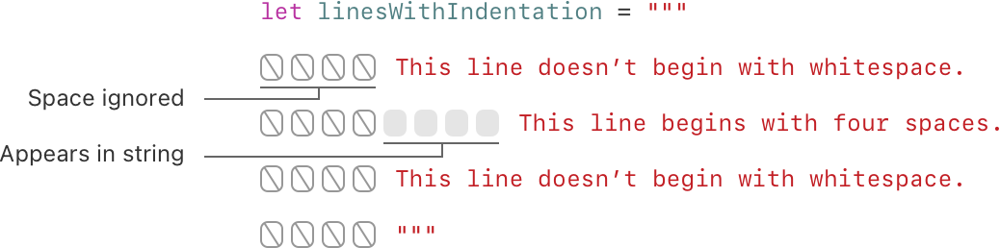

# 字符串和字符

## 字符串字面量

```swift
let someString = "Some string literal value"
```

### 多行字符串字面量

```swift
let quotation = """
The White Rabbit put on his spectacles.  "Where shall I begin,
please your Majesty?" he asked.

"Begin at the beginning," the King said gravely, "and go on
till you come to the end; then stop."
"""
```

#### 续行符（`\`）
如果你想换行，以便加强代码的可读性，但是你又不想在你的多行字符串字面量中出现换行符的话，你可以用在行尾写一个反斜杠（\）作为续行符。

```swift
let softWrappedQuotation = """
The White Rabbit put on his spectacles.  "Where shall I begin, \
please your Majesty?" he asked.

"Begin at the beginning," the King said gravely, "and go on \
till you come to the end; then stop."
"""
```

#### 缩进

如果你在某行的前面写的空白字符串超出了关闭引号（`"""`）之前的空白字符串，则超出部分将被包含在多行字符串字面量中。



在上面的例子中，尽管整个多行字符串字面量都是缩进的（源代码缩进），第一行和最后一行没有以空白字符串开始（实际的变量值）。中间一行的缩进用空白字符串（源代码缩进）比关闭引号（`"""`）之前的空白字符串多，所以，它的行首将有4个空格。

### 字符串字面量的特殊字符
* 转义字符 `\0`(空字符)、`\\`(反斜线)、`\t`(水平制表符)、`\n`(换行符)、`\r`(回车符)、`\"`(双引号)、`\'`(单引号)。
* Unicode 标量，写成 `\u{n}`(u 为小写)，其中 `n` 为任意一到八位十六进制数且可用的 Unicode 位码。

由于多行字符串字面量使用了三个双引号，而不是一个，所以你可以在多行字符串字面量里直接使用双引号（`"`）而不必加上转义符（`\`）。要在多行字符串字面量中使用 `"""` 的话，就需要使用至少一个转义符（`\`）

```swift
let threeDoubleQuotes = """
Escaping the first quote \"""
Escaping all three quotes \"\"\"
"""
```

### 扩展字符串分隔符

形式： `#"<内容>#"`

**注意：** `#` 个数可以是多个，但是要前后一致，如 `##"123"##`

例如，打印字符串文字 `#"Line 1 \nLine 2"#` 会打印换行符转义序列（`\n`）而不是给文字换行。


如果需要字符串文字中字符的特殊效果，需要在转义字符（`\n`）后面添加符号 `#`

例如如果您的字符串是 `#"Line 1 \nLine 2"#` 并且您想要换行，则可以使用 `#"Line 1 \#nLine 2"#` 来代替。

多行也可以，此时可以覆盖原有的结束文字的默认行为
```swift
let threeMoreDoubleQuotationMarks = #"""
Here are three more double quotes: """
"""#
```

## 初始化空字符串

```swift
var emptyString = ""               // 空字符串字面量
var anotherEmptyString = String()  // 初始化方法
// 两个字符串均为空并等价。

let catCharacters: [Character] = ["C", "a", "t", "!", "🐱"]
let catString = String(catCharacters) //传递一个值类型为 Character 的数组作为自变量来初始化
```

## 字符
可通过 for-in 循环来遍历字符串，获取字符串中每一个字符的值：

```swift
for character in "Dog!🐶" {
    print(character)
}
// D
// o
// g
// !
// 🐶
```

通过标明一个 Character 类型并用字符字面量进行赋值，可以建立一个独立的字符常量或变量：

```swift
let exclamationMark: Character = "!"
```

## 连接字符串和字符

字符串之间可通过 `+=` 进行连接

字符串和字符可通过 `append()` 方法将字符添加到字符串变量尾部

### 多行字符串拼接

**注意：** 需要字符串每一行都以换行符结尾，包括最后一行

```swift
let badStart = """
one
two
"""
let end = """
three
"""
print(badStart + end)
// 打印两行:
// one
// twothree

let goodStart = """
one
two

"""
print(goodStart + end)
// 打印三行:
// one
// two
// three
```

## 字符串插值


形式： `"\(变量名) other string"`

**注意：** 插值字符串中写在括号中的表达式不能包含非转义反斜杠（`\`），并且不能包含回车或换行符。不过，插值字符串可以包含其他字面量。

```swift
let multiplier = 3
let message = "\(multiplier) times 2.5 is \(Double(multiplier) * 2.5)"
// message 是 "3 times 2.5 is 7.5"
```

如果想包含不作为字符串插值处理的字符，可以可以使用扩展字符串分隔符创建字符串

```swift
print(#"Write an interpolated string in Swift using \(multiplier)."#)
// 打印 "Write an interpolated string in Swift using \(multiplier)."
```

如果要在使用扩展字符串分隔符的字符串中使用字符串插值，需要在反斜杠后面添加与开头和结尾数量相同扩展字符串分隔符。例如：

```swift
print(#"6 times 7 is \#(6 * 7)."#)
// 打印 "6 times 7 is 42."
```

## Unicode
TODO:

## 计算字符数量

如果想要获得一个字符串中 `Character` 值的数量，可以使用 `count` 属性：

```swift
let unusualMenagerie = "Koala 🐨, Snail 🐌, Penguin 🐧, Dromedary 🐪"
print("unusualMenagerie has \(unusualMenagerie.count) characters")
// 打印输出“unusualMenagerie has 40 characters”
```

## 访问和修改字符串
### 字符串索引

每一个 `String` 值都有一个关联的索引（`index`）类型，`String.Index`，它对应着字符串中的每一个 `Character` 的位置。

常用的几个方法

* `startIndex` 获取一个 String 的第一个 `Character` 的索引
* `endIndex` 获取一个 String 的最后一个 `Character` 的**后一个位置**的索引，因此，`endIndex` 属性不能作为一个字符串的有效下标
* `index(before:)` 得到当前索引的前一个索引
* `index(after:)` 得到当前索引的后一个索引
* `index(_:offsetBy:)` 获取对应偏移量的索引，此方法可避免多次调用 `index(before:)` 或 `index(after:)` 方法

可以使用下标语法来访问 `String` 特定索引的 `Character`

```swift
let greeting = "Guten Tag!"
greeting[greeting.startIndex]
// G
greeting[greeting.index(before: greeting.endIndex)]
// !
greeting[greeting.index(after: greeting.startIndex)]
// u
let index = greeting.index(greeting.startIndex, offsetBy: 7)
greeting[index]
// a
```

使用 `indices` 属性会创建一个包含全部索引的范围（`Range`），用来在一个字符串中访问单个字符。

```swift
for index in greeting.indices {
   print("\(greeting[index]) ", terminator: "")
}
// 打印输出“G u t e n   T a g ! ”
```

### 插入和删除

#### 插入

* `insert(_:at:)` 在一个字符串的指定索引插入一个字符
* `insert(contentsOf:at:)` 在一个字符串的指定索引插入一段字符串。

```swift
var welcome = "hello"
welcome.insert("!", at: welcome.endIndex)
// welcome 变量现在等于 "hello!"

welcome.insert(contentsOf:" there", at: welcome.index(before: welcome.endIndex))
// welcome 变量现在等于 "hello there!"
```
#### 删除

* `remove(at:)` 在一个字符串的指定索引删除一个字符
* `removeSubrange(_:)` 在一个字符串的指定索引删除一个子字符串
  
```swift
welcome.remove(at: welcome.index(before: welcome.endIndex))
// welcome 现在等于 "hello there"

let range = welcome.index(welcome.endIndex, offsetBy: -6)..<welcome.endIndex
welcome.removeSubrange(range)
// welcome 现在等于 "hello"
```

## 子字符串

使用`下标`或者 `prefix(_:)` 之类的方法就可以得到一个 `Substring` 的实例

类型： `Substring`

使用场景： 短时间内操作字符串时使用，如需长时间保存结果，最好转化为 `String` 类型

> 因为它重用了原 String 的内存空间，原 String 的内存空间必须保留直到它的 Substring 不再被使用为止。

```swift
let greeting = "Hello, world!"
let index = greeting.firstIndex(of: ",") ?? greeting.endIndex
let beginning = greeting[..<index]
// beginning 的值为 "Hello"

// 把结果转化为 String 以便长期存储。
let newString = String(beginning)
```

### 子字符串和字符串的异同

相同点：
* 都在内存里保存字符集

不同点：
* `Substring` 可以重用原 `String` 的内存空间，或者另一个 `Substring` 的内存空间（`String` 也有同样的优化，但如果两个 `String` 共享内存的话，它们就会相等）


## 字符串比较

### 字符串字符相等

通过 `==` 或 `!=` 来比较

### 前缀相等

通过 `hasPrefix(_:)` 来比较

```swift
var act1SceneCount = 0
for scene in romeoAndJuliet {
    if scene.hasPrefix("Act 1 ") {
        act1SceneCount += 1
    }
}
print("There are \(act1SceneCount) scenes in Act 1")
// 打印输出“There are 5 scenes in Act 1”
```

### 后缀相等

通过 `hasSuffix(_:)` 来比较

```swift
var mansionCount = 0
var cellCount = 0
for scene in romeoAndJuliet {
    if scene.hasSuffix("Capulet's mansion") {
        mansionCount += 1
    } else if scene.hasSuffix("Friar Lawrence's cell") {
        cellCount += 1
    }
}
print("\(mansionCount) mansion scenes; \(cellCount) cell scenes")
// 打印输出“6 mansion scenes; 2 cell scenes”
```

## 字符串的 Unicode 表示形式

TODO: 